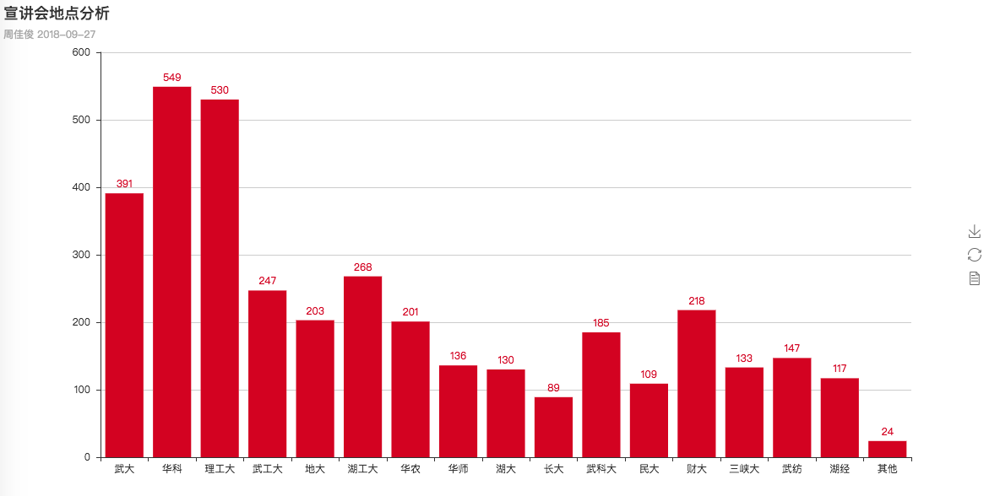
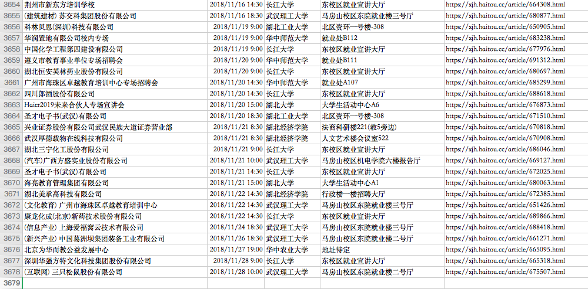

# 海投爬虫项目
此项目的目的是爬取海投网上武汉地区所有宣讲会信息
#### 用到的主要技术：scrapy, 正则表达式解析，mongodb存储, pyecharts可视化
#### proxypool为代理池包，核心代码来源于百度
#### dateview是数据可视化的处理，用到了pyecharts包，分析了各个高校的宣讲会数量
  

### 爬出的数据存储到MongoDB，导出后的excel文件在docs文件夹里
##### 按照宣讲时间排序,一共3677条数据，一直到11月28号
##### 共截取了公司，时间，宣讲大学，地点，以及页面url五个字段
  

### 环境: python3.7 scrapy1.0.1
依赖包: pyecharts, pymongo

### 运行:
    pip3 install pyecharts, pymongo
    cd xuanjiang
    python3 run.py
